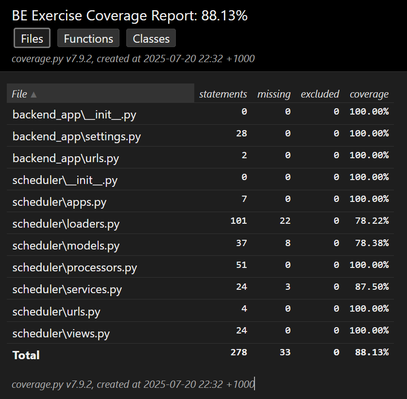

# BE Exercise - Schedule Management API

Django 5.2 REST API for processing worker schedule data

## 🚀 Quick Start

### Installation
```bash
pip install -r requirements.txt
python manage.py migrate
python manage.py runserver
```

### API Endpoint
```
GET /api/schedule-table/
```
Returns schedule data in optimised table format.

## Test Coverage & Performance

### Run Tests
```bash
# Unit tests with coverage
coverage run --source=. manage.py test
coverage html

# Performance tests (100.000x scale)
python manage.py test scheduler.tests.performance
```

## Key highlights of this app
- In processing schedule table, I avoided nested loops and used hashmaps smartly to achieve O(n) when iterating through the list of assignments and positions + workers to construct the rows. This is proved in my performance test.
- Performance test is particularly valued as /schedule-table is the most used endpoint in scheduling app so I made sure the runtime and memory cost do not blow up when the input data is larger. **The algorithm achieves less than 3x runtime** with 100x data increase.

  Performance Scaling Analysis:

  | Data Scale | Runtime (s) | Memory (MB) | Data Scale Factor | Runtime Ratio | Memory Ratio | Runtime Efficiency* | Memory Efficiency* |
  |------------|-------------|-------------|-------------------|---------------|--------------|--------------------|--------------------|
  | 1x         | 0.0281      | 0.0039      | -                 | -             | -            | -                  | -                  |
  | 10x        | 0.0342      | 0.0703      | 10x               | 1.22x         | 18.03x (stablised in higher scaling factor so it is ok)       | **0.12** (excellent) | 1.80 (acceptable) |
  | 20x        | 0.0365      | 0.1094      | 2x                | 1.07x         | 1.56x        | **0.53** (excellent) | **0.78** (excellent) |
  | 50x        | 0.0432      | 0.3945      | 2.5x              | 1.18x         | 3.61x        | **0.47** (excellent) | 1.44 (acceptable) |
  | 100x       | 0.0524      | 0.6055      | 2x                | 1.21x         | 1.54x        | **0.61** (excellent) | **0.77** (excellent) |

- Tests with extremely large data show the endpoint finishes in linear scaling factor with the data but it is not ideal in production as it is longer than 1 second (33s for 100.000x input, 2.5s for 10.000x input). Future improvements could limit the date range, positions or workers so that it does not overwhelm the backend with one request.
- Of course, tests to validate output correctness are also implemented and achieve high coverage.

  

- The endpoint can handle `null` position value in task and position and put that into calculation under "Empty Position" row. However, if position is allowed to be empty, I think this can also be an official position in the database. The endpoint handling adding/editing worker, position, task should use Position = (id = 10 or any number, name: "Empty position") and /schedule-table endpoint can be much simpler.   
  I assume task with `null` position can accept worker with any position and this person will be listed under "Empty position" row in schedule table.
- Data is cached with `DataLoader` class to reduce the number of data loading times or Database queries in real scenarios. This can be migrated to Redis or Database native caching if possible to reduce the load on server and application-level.
- Applying **singleton** pattern to reuse DataLoader and ScheduleDataProcessor in services.py, reducing DB connection and computational usage.
- Professional automated CI on Pull Requests: tests must all pass, check dependencies, code quality and format.
- Developed with AI-assisted coding (Cursor AI) to accelerate implementation of my technical design and approach.
